# Yii 2.0 博客系统


## 第一章 概述

### 系统功能

- 本博客系统分为前台和后台两个系统，前台和后台分别由用户和管理员登陆使用

  - 前台（博客系统——用户）
    - 用户注册
    - 用户登陆
    - 浏览文章
    - 创建文章
    - 编辑文章
    - 删除文章
    - 图片轮播
    - 留言板
    - 最新文章
    - 热门浏览
    - 标签云


  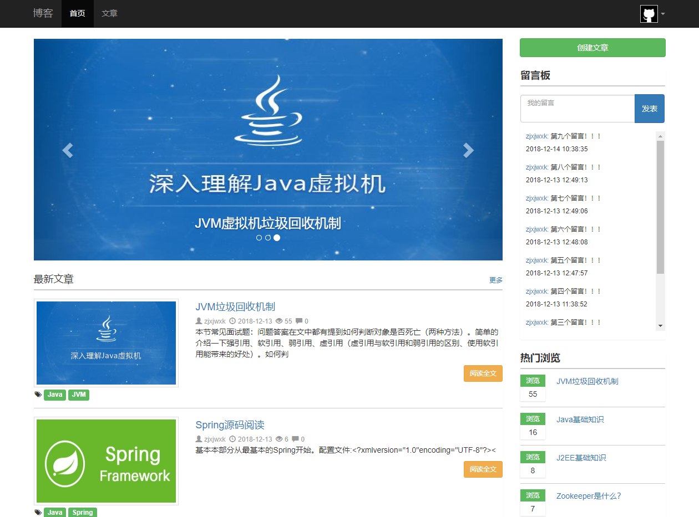


  - 后台（博客管理系统——管理员）

    - 内容管理

      - 文章管理
      - 分类管理
      - 标签管理
      - 留言管理

    - 用户管理


  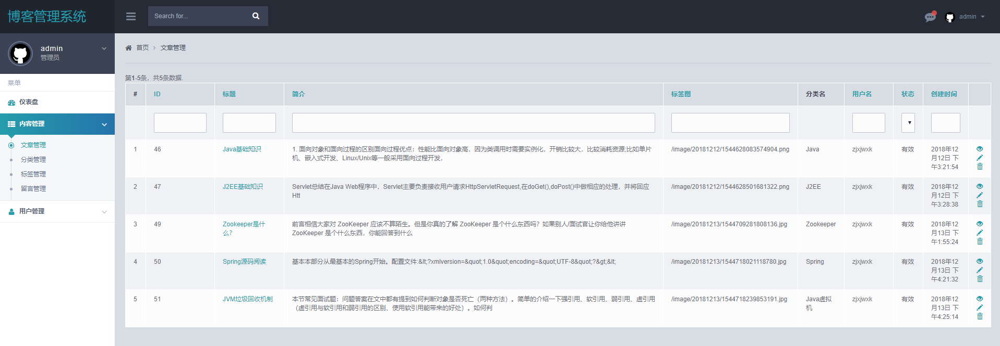


### 系统特点

- 博客首页具有图片轮播功能，可以为用户推荐最新最热的文章
- 留言板使用ajax异步更新，优化用户体验
- 热门浏览根据文章浏览量为用户推荐热门文章
- 标签云方便用户寻找所需分类标签的文章
- 使用百度开源HTML编辑器UEditor，让用户获得所见即所得的编辑效果


## 第二章 需求分析

### 用户需求分析

- 注册模块
  - 描述：需根据用户输入的用户名、邮箱、密码、确认密码、验证码，进行合法性验证和存在性验证后，完成用户注册。
  - 业务流程：需接收前端的注册表单参数，传入Controller层，进行参数合法性验证和数据库存在性验证后，完成注册，将用户信息写入数据库并跳转到View层的主页或提示相应错误。
- 登陆模块
  - 描述：需根据用户输入的用户名、密码，进行正确性验证后，完成用户登陆。
  - 业务流程：需接收前端的登陆表单参数，传入Controller层，进行正确性验证后，完成登陆跳转到View层的主页或提示相应错误。
- 主页模块
  - 描述：需显示顶部导航栏和图片轮播组件、文章列表组件、创建文章按钮、留言板组件、热门浏览组件、标签云组件
  - 业务流程：需在主页上的合适位置显示标签栏、创建文章按钮和已经实现的图片轮播、文章列表、留言板、热门浏览、标签云组件。
- 文章模块
  - 文章主页
    - 描述：需在文章主页上显示文章列表组件、创建文章按钮、热门浏览组件和标签云组件
    - 业务流程：需在文章主页上的合适位置显示这四个组件预先实现的组件即可
  - 文章创建
    - 描述：需根据用户输入的标题、分类、标签图、内容和标签，完成文章创建。
    - 业务流程：前端文章内容的编辑需使用百度UEditor富文本编辑器，标签图及标签的添加使用Yii开源扩展组件，后端Controller层接收文章表单参数，为其设定一个场景，以便在文章创建后添加和触发事件（添加标签或增加标签的文章数、将文章与标签的关联关系写入数据库），对文章表单参数进行合法性验证后，文章创建成功并跳转到View层的文章浏览界面或提示相应错误。
  - 文章编辑
    - 描述：需根据文章id号获取原有的标题、分类、标签图、内容和标签，用户对各个内容进行编辑后，更新数据库中对应id文章的内容，并跳转到文章浏览页面。
    - 业务流程：用户在文章浏览页面点击编辑文章后，将文章id传入Controller层的文章控制器，控制器根据id获取文章相关内容后传入View层的文章编辑页面，将原先的文章相关信息显示在表单中，待用户编辑更新内容后并保存后，将文章相关内容和id值传入Controller层，根据id值更新数据库中文章的相关内容，并跳转到View层的文章浏览页面。
  - 文章删除
    - 描述：需根据文章id号删除数据库中的文章和相应关联的数据表内容，并跳转到文章主页。
    - 业务流程：用户在文章浏览页面点击删除文章后，将文章id传入Controller层的文章控制器，控制器根据id删除数据库中的文章，并跳转到View层的文章主页。
  - 文章浏览
    - 描述：需根据要浏览的文章id号，从数据库中获取该文章的相应内容，并跳转到该文章浏览页面。
    - 业务流程：需在用户点击文章链接后，将文章id传入Controller层的文章控制器，控制器根据id号，获取数据库中文章的相应内容，传入并跳转到View层的文章浏览页面。
- 轮播组件
  - 描述：需使用Bootstrap或相关开源组件在博客主页上实现图片轮播，播放热门文章的标签图
  - 业务流程：使用Bootstrap或相关开源组件在博客主页上实现图片轮播，Controller层获取数据库中浏览量前三的文章，将文章标签图和id传入轮播组件的View层中。
- 留言组件
  - 描述：前端需使用Yii社区的开源扩展组件，封装Ajax异步更新，以在用户留言后更新数据库内容，并异步更新页面留言内容。
  - 业务流程：需在用户点击留言按钮后，将用户id和留言内容传入Controller层，控制器根据用户id和留言内容，插入数据库的留言表。留言组件则在自己的View层中使用Ajax获取数据库内容进行异步更新。
- 热门浏览组件
  - 描述：前端需使用Yii社区的开源扩展组件，根据文章浏览量从高到低显示文章的浏览量和标题链接。
  - 业务流程：需在博客主页和文章主页显示该组件，Controller层根据文章的浏览量从高到低获取数据库中的文章id、标题和浏览量，传入热门浏览组件的View层中。
- 文章列表组件
  - 描述：前端需使用Yii社区的开源扩展组件，根据文章更新的时间从高到低显示文章的标题、标签图、标签、简介、用户名、更新时间和浏览量，一个阅读全文按钮。
  - 业务流程：需在博客主页和文章主页显示该组件，Controller层根据文章的更新时间从高到低获取数据库中文章的相关内容，封装为Model传入文章列表组件的View层中。
- 标签云组件
  - 描述：前端需使用Yii社区的开源扩展组件，根据各个标签有的文章数，从高到低显示各个标签。
  - 业务流程：需在博客主页和文章主页显示该组件，Controller层根据标签表中对应的文章数从高到低获取标签内容，并传入标签云组件的View层中。

### 管理员需求分析

- 登陆模块
  - 描述：需根据管理员输入的管理员名、密码，进行正确性验证后，完成管理员登陆。
  - 业务流程：需接收前端的登陆表单参数，传入Controller层，进行正确性验证后，完成登陆跳转到View层的管理系统主页或提示相应错误。

- 内容管理
  - 文章管理
    - 描述：需实现文章的增删改查。
    - 业务流程：省略。由Gii 的 CRUD Generator 生成。
  - 分类管理
    - 描述：需实现分类的增删改查。
    - 业务流程：省略。由Gii 的 CRUD Generator 生成。
  - 标签管理
    - 描述：需实现标签的增删改查。
    - 业务流程：省略。由Gii 的 CRUD Generator 生成。
  - 留言管理
    - 描述：需实现留言的增删改查。
    - 业务流程：省略。由Gii 的 CRUD Generator 生成。
- 用户管理
  - 描述：需实现用户的增删改查。

  - 业务流程：省略。由Gii 的 CRUD Generator 生成。


## 第三章 详细设计

### Yii 框架

- Yii 框架官网：https://www.yiiframework.com
- 本项目使用了Yii 框架官方的 Yii 2 Advanced Project Template 模板

- Yii 2高级项目模板

  - Github仓库：https://github.com/yiisoft/yii2-app-advanced

  - Yii 2高级项目模板是一个最基本的 Yii 2 应用程序，用于开发具有多层的复杂Web应用程序。

    模板包括三个层：前端，后端和控制台，每个都是单独的Yii应用程序。

  - 有关Yii 2高级项目模板的框架结构说明见：https://github.com/yiisoft/yii2-app-advanced/blob/master/docs/guide-zh-CN/README.md

- gii

  - gii 介绍：https://www.yiiframework.com/doc/guide/2.0/zh-cn/start-gii
  - 本项目部分代码由 Gii 的Model Generator 和 CRUD Generator 生成

### 开发环境及配置

- Apace 服务器

  - 添加虚拟主机

    - 在 C:\wamp64\bin\apache\apache2.4.35\conf\extra\httpd-vhosts.conf 添加如下虚拟主机：

      - ```php
        <VirtualHost *:80>
          DocumentRoot "D:/Documents/PHP/Blog/frontend/web"
          ServerName frontend.zjxjwxk.com
        </VirtualHost>
         
        <VirtualHost *:80>
        DocumentRoot "D:/Documents/PHP/Blog/backend/web"
        ServerName backend.zjxjwxk.com
        </VirtualHost>
        ```

- 添加本机hosts模拟域名

  - 在 C:\Windows\System32\drivers\etc\hosts 添加以下配置

    - 127.0.0.1 frontend.zjxjwxk.com

    - 127.0.0.1 backend.zjxjwxk.com

- MySQL 数据库

  - 请使用数据库备份脚本blog.sql

- Sublime Text3 编辑器

- Navicat 数据库管理工具

### 目录结构

- 根目录下

  - `backend` - 后端应用（博客管理系统——管理员）

    - `assets` - 后端应用的静态资源路径配置

      - `AppAsset.php` - 应用的静态资源路径配置
      - `LoginAsset.php` - 登陆的静态资源路径配置

    - `config` - 配置

      - `main.php` - 主要配置文件

        - 主要添加了以下配置

          - 语言包配置（将语言包设为中文）

            ```php
                'language' => 'zh-CN',
            ```

          - url管家配置（用于美化url）

            ```php
            'urlManager' => [
                        'enablePrettyUrl' => true,
                        'showScriptName' => false,
                        'rules' => [],
                    ],
            ```

      - `params.php` - 参数配置文件

        - 主要添加了以下配置

          - 头像图片路径配置

            ```php
                'avatar' => [
                	'small' => '/statics/images/avatar/small.png',
                ]
            ```

    - `controllers` - 控制器层

      - `CatController.php` - 分类管理控制器，实现分类模型的CRUD操作
      - `FeedController.php` - 留言管理控制器，实现留言模型的CRUD操作
      - `PostController.php` - 文章管理控制器，实现文章模型的CRUD操作
      - `SiteController.php` - 主页控制器
      - `TagController.php` - 标签管理控制器，实现标签模型的CRUD操作
      - `UserController.php` - 用户管理控制器，实现用户模型的CRUD操作

    - `models` - 模型层

      - `LoginForm.php` - 登陆表单模型，用做表单模型和参数验证
        - 具有登陆表单的参数变量
        - rules() - 对参数的合法性验证
        - attributeLabels() - 在rules()验证的时候，如果前面的参数报错，则显示后面的内容
        - validatePassword() - 密码的正确性验证
        - login() - 用户登陆和记住密码的cookie时间设置
        - getUser() - 根据用户名获得用户模型

    - `views` - 视图层

      - `cat` - 分类管理页面
      - `feed` - 留言管理页面
      - `layouts` - 布局
        - `login.php` - 登陆布局
        - `main.php` - 主界面布局
      - `post` - 文章管理页面
      - `site` - 登陆和主页页面
        - `error.php` - 错误页面
        - `index.php` - 面包屑页面
        - `login.php` - 登陆页面
      - `tag` - 标签管理页面
      - `user` - 用户管理页面

    - `web` - 网页资源

      - `statics` - 静态资源
        - `css` - css
        - `images` - 图片
        - `js` - js
      - `.htaccess` - 超文本入口，实现重定向，用于实现url美化

    - `widgets` - 组件

      - `sidebar` - 侧边栏组件

  - `common` - 所有应用程序共有文件

    - `config` - 共有配置

      - `main-local.php` - 主要配置了数据库

        - ```php
              'db' => [
                  'class' => 'yii\db\Connection',
                  'dsn' => 'mysql:host=localhost;dbname=blog',
                  'username' => 'root',
                  'password' => '19981018',
                  'charset' => 'utf8',
              ],
          ```

    - `models` - 前端和后端共有模型

      - `base` - 基类模型
        - `BaseModel.php` - 基类模型，实现了数据分页
      - `AdminModel.php` - 管理员模型
      - `CatModel.php` - 分类模型
      - `FeedModel.php` - 留言模型
      - `PostExtendModel.php` - 文章扩展模型
      - `PostModel.php` - 管理员模型
      - `RelationPostTagModel.php` - 文章标签模型
      - `TagModel.php` - 标签模型
      - `UserModel.php` - 用户模型

    - `widgets` - 公用组件

      - `file-upload` - 标签图上传组件
      - `tags` - 标签组件
      - `ueditor` - 百度UEditor富文本编辑器组件

  - `frontend` - 前端应用（博客系统——用户）

    - `assets` - 前端应用的静态资源路径配置

      - `AppAsset.php` - 应用的静态资源路径配置

    - `config` - 配置

      - `main.php` - 主要配置文件

        - 主要添加了以下配置

          - 语言包配置（将语言包设为中文）

            ```php
                'language' => 'zh-CN',
            ```

          - url管家配置（用于美化url）

            ```php
            'urlManager' => [
                        'enablePrettyUrl' => true,
                        'showScriptName' => false,
                        'rules' => [],
                    ],
            ```

      - `params.php` - 参数配置文件

        - 主要添加了以下配置

          - 头像和默认标签图路径配置

          - ```php
            'avatar' => [
            	'small' => '/statics/images/avatar/small.jpg',
            ],
            'default_label_img' => '/statics/images/default/yii.jpg',
            ```

    - `controllers` - 控制器层

      - `base` - 基类控制器
        - `BaseController` - 基类控制器
      - `PostController` - 文章控制器，实现访问控制，实现了组件路由，文章主页、创建文章、编辑文章、删除文章、文章详情的路由。
      - `SiteController` - 主页控制器，主要实现主页、注册、登陆、退出、留言的路由

    - `messages` - 语言包配置

      - `zh-CN` - 中文语言包
        - `common.php` - 中文配置

    - `models` - 模型层

      - `FeedForm.php` - 留言表单模型。主要由create() 实现留言创建功能
      - `LoginForm.php` - 登陆表单模型
      - `PostForm.php` - 文章表单模型。包含两个场景和事件，用于在创建和更新文章的场景后触发事件，如创建和更新文章后将文章相关标签和扩展数据如浏览量存入数据库。主要实现文章创建、文章编辑、获得文章详情功能。
      - `SignupForm.php` - 注册表单模型，主要实现用户注册功能
      - `TagForm.php` - 标签表单模型，主要实现保存标签集合功能

    - `views` - 视图层

      - `layouts` - 布局
        - `main.php` - 主要布局
      - `post` - 文章视图
        - `create.php` - 文章创建视图
        - `index.php` - 文章主页视图
        - `update` - 文章更新视图
        - `view.php` - 文章浏览视图
      - `site` - 主页视图
        - `error.php` - 错误页面视图
        - `index.php` - 博客主页视图
        - `login.php` - 登陆视图
        - `signup.php` - 注册视图

    - `web` - 网页资源

      - `image` - 用户上传的图片
      - `statics` - 静态资源
        - `css` - css
        - `images` - 图片
        - `js` - js
      - `.htaccess` - 超文本入口，实现重定向，用于实现url美化

    - `widgets` - 组件

      - `banner` - 图片轮播组件
      - `chat` - 留言版组件
      - `hot` - 热门浏览组件
      - `post` - 文章列表组件
      - `tag` - 标签云组件


## 第四章 数据库设计


### 用户

| 标识符        | 意义        | 类型     | 值域 |
| ------------- | ----------- | -------- | ---- |
| id            | 自增ID      | int      | 11   |
| username      | 用户名      | varchar  | 255  |
| auth_key      | 自动登陆key | varchar  | 32   |
| password_hash | 加密密码    | varchar  | 255  |
| email         | 邮箱        | varchar  | 255  |
| status        | 状态        | smallint | 6    |
| avatar        | 头像        | varchar  | 255  |
| created_at    | 创建时间    | int      | 11   |
| updated_at    | 更新时间    | int      | 11   |


### 管理员

| 标识符        | 意义        | 类型     | 值域 |
| ------------- | ----------- | -------- | ---- |
| id            | 自增ID      | int      | 11   |
| username      | 用户名      | varchar  | 255  |
| auth_key      | 自动登陆key | varchar  | 32   |
| password_hash | 加密密码    | varchar  | 255  |
| email         | 邮箱        | varchar  | 255  |
| status        | 状态        | smallint | 6    |
| avatar        | 头像        | varchar  | 255  |
| created_at    | 创建时间    | int      | 11   |
| updated_at    | 更新时间    | int      | 11   |


### 分类

| 标识符   | 意义     | 类型    | 值域 |
| -------- | -------- | ------- | ---- |
| id       | 自增ID   | int     | 11   |
| cat_name | 分类名称 | varchar | 255  |


### 文章

| 标识符     | 意义                        | 类型     | 值域 |
| ---------- | --------------------------- | -------- | ---- |
| id         | 自增ID                      | int      | 11   |
| title      | 标题                        | varchar  | 255  |
| summary    | 摘要                        | varchar  | 255  |
| content    | 内容                        | longtext | 0    |
| label_img  | 标签图                      | varchar  | 255  |
| cat_id     | 分类id                      | int      | 11   |
| user_id    | 用户id                      | int      | 11   |
| user_name  | 用户名                      | varchar  | 255  |
| is_valid   | 是否有效：0-未发布 1-已发布 | tinyint  | 1    |
| created_at | 创建时间                    | int      | 11   |
| updated_at | 更新时间                    | int      | 11   |


### 文章扩展

| 标识符  | 意义   | 类型 | 值域 |
| ------- | ------ | ---- | ---- |
| id      | 自增ID | int  | 11   |
| post_id | 文章ID | int  | 11   |
| browser | 浏览量 | int  | 11   |


### 标签

| 标识符    | 意义       | 类型    | 值域 |
| --------- | ---------- | ------- | ---- |
| id        | 自增ID     | int     | 11   |
| tag_name  | 标签名称   | varchar | 255  |
| post_name | 关联文章数 | int     | 11   |


### 文章和标签关系

| 标识符  | 意义   | 类型 | 值域 |
| ------- | ------ | ---- | ---- |
| id      | 自增ID | int  | 11   |
| post_id | 文章ID | int  | 11   |
| tag_id  | 标签ID | int  | 11   |


### 留言

| 标识符     | 意义     | 类型    | 值域 |
| ---------- | -------- | ------- | ---- |
| id         | 自增ID   | int     | 11   |
| user_id    | 用户ID   | int     | 11   |
| content    | 内容     | varchar | 255  |
| created_at | 创建时间 | int     | 11   |


## 第五章 实现功能

### MVC架构流程图

- 所有功能实现基于MVC架构
  - 前端页面将表单参数通过GET或POST方式传入Controller
  - Controller将获得的参数用Model封装后，进行业务逻辑处理
  - 使用经过业务逻辑处理的Model，与数据库交互（增删改查）
  - 获取数据库的数据，封装成前端需要显示的Model
  - 向封装好的Model传入需要显示的View，View获取Model中的数据
  - 将View在前端页面中显示

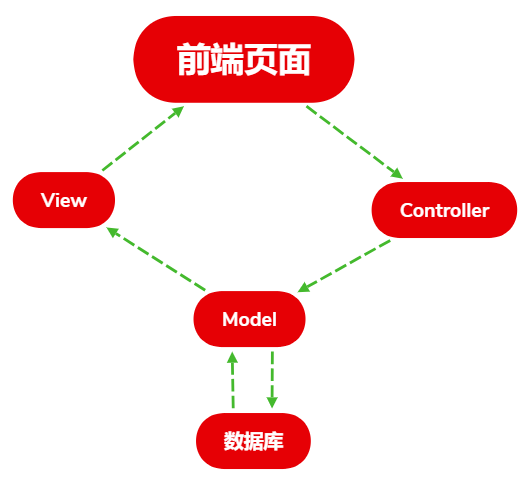


### 前台（博客系统——用户）

- 注册模块

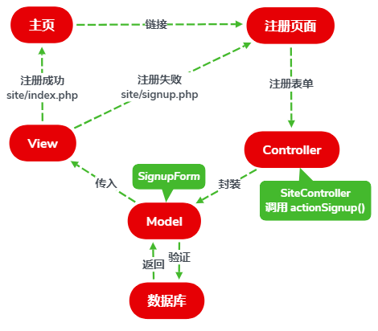

- 登陆模块

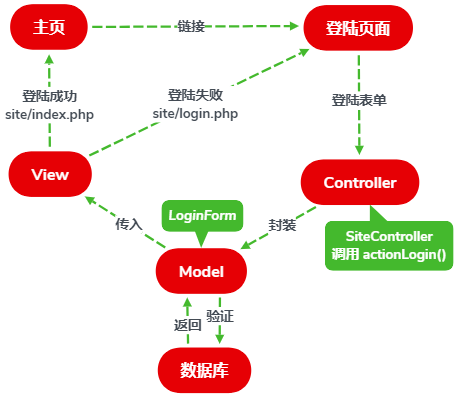

- 主页模块

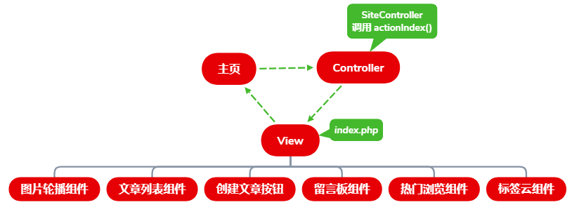

- 文章模块

  - 文章主页

    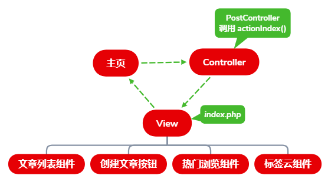

  - 文章创建

    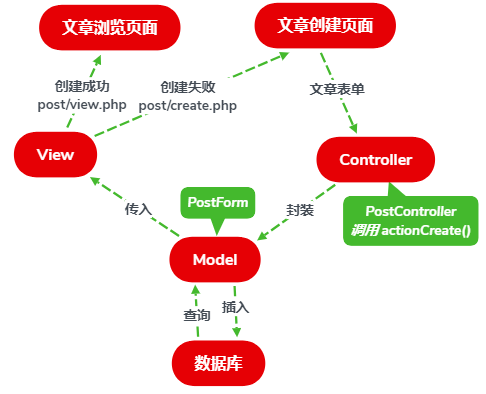

  - 文章编辑

  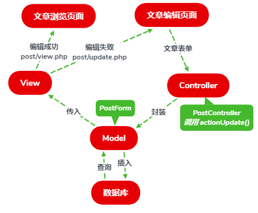

  - 文章删除

  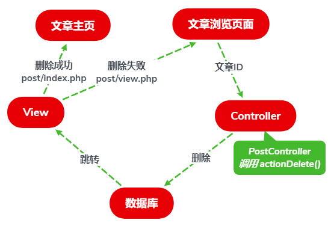

  - 文章浏览

  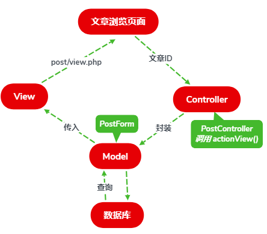

- 留言组件

  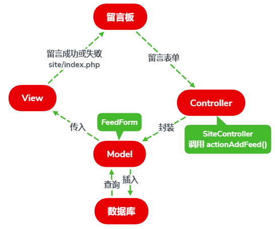

- 热门浏览组件

  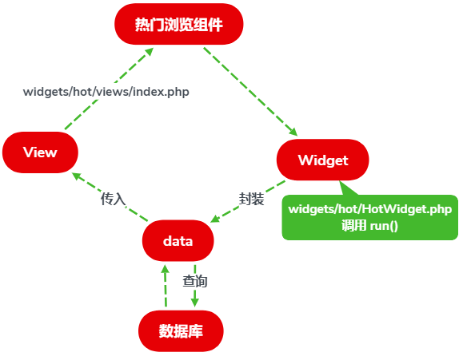

- 文章列表组件

  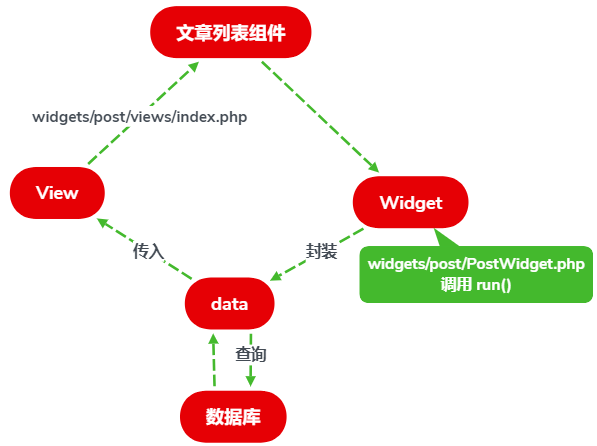

- 标签云组件

  

### 后台（博客管理系统——管理员）

- 由于后台对数据库实体的CRUD操作较为统一，均可由gii生成，仅以下图表示

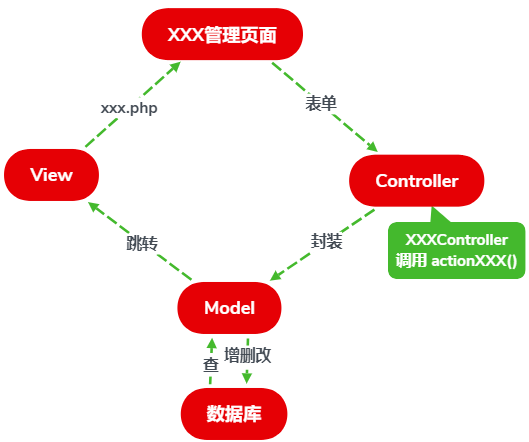

# 总结

在开发此博客系统之前，为了提高开发效率和优化项目架构，决定使用PHP框架Yii 进行开发，本人曾使用过Java的后端框架如Spring MVC进行过许多项目开发。在学习Yii 框架时，便很容易上手，学习了Yii 2.0框架的基本知识和开发过程。若使用课堂上所讲的原生PHP，可能开发效率较低，代码结构不够清晰，Yii 框架则使用MVC架构模式，对整个项目进行数据-视图-业务逻辑的分离，使得开发过程思路明确。Yii 的组件功能Widget简化了前端开发，在页面设计时，只需实现各个组件，最后在页面上添加组件即可，每个组件又各自拥有类似的MVC架构。组件化开发避免了前端需要修改多个页面的繁琐。同时，Yii 自带的 Gii 可以根据数据库表生成对应的Model、View、Controller，实现基本的CRUD操作，避免了机械的CRUD，而把精力集中在核心业务逻辑的开发中。


### Thank you